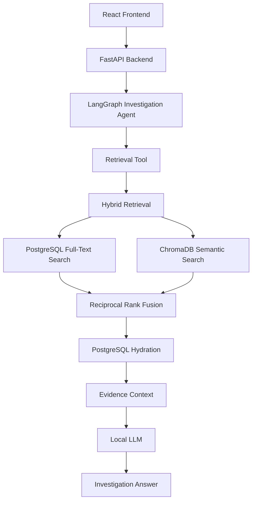
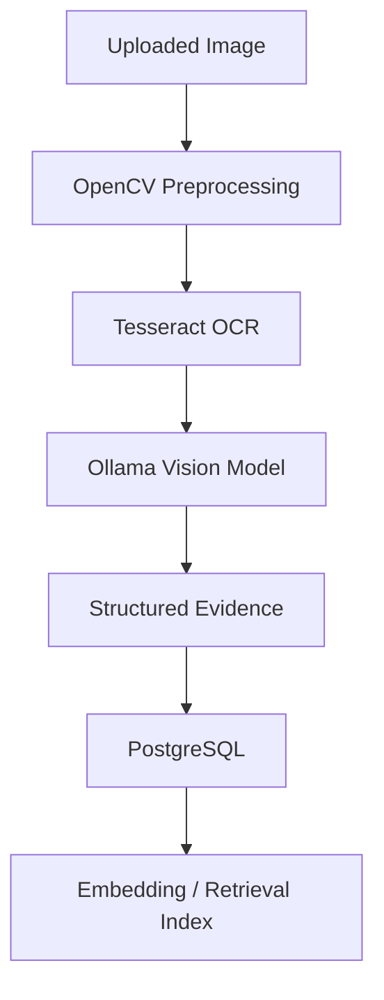

# VectorVanguard

**Offline AI Exam Evidence Investigation System**

VectorVanguard is a privacy-first, offline AI-powered system for investigating exam evidence *after* an exam has taken place. It ingests static evidence (images / CCTV snapshots), extracts and analyzes their content locally, and lets an investigator ask natural-language questions that are answered by a retrieval-augmented AI agent grounded in the stored evidence.

> **Scope note:** VectorVanguard is a **post-exam, offline, evidence-based, AI-assisted investigation tool**. It is **not** a real-time proctoring system. It does not perform live camera surveillance, real-time face detection, live audio monitoring, real-time cheating detection, or automatic disciplinary decision-making.

---

## Table of Contents

- [Purpose](#purpose)
- [Key Features](#key-features)
- [Architecture](#architecture)
- [Technology Stack](#technology-stack)
- [Local AI Models](#local-ai-models)
- [Database Design](#database-design)
- [Evidence Processing Pipeline](#evidence-processing-pipeline)
- [Structured Evidence](#structured-evidence)
- [Retrieval System](#retrieval-system)
- [Investigation Agent](#investigation-agent)
- [Frontend](#frontend)
- [API Endpoints](#api-endpoints)
- [Project Structure](#project-structure)
- [Privacy & Offline Design](#privacy--offline-design)
- [Project Status](#project-status)
- [Tested Functionality](#tested-functionality)
- [Setup](#setup)
- [Usage Workflow](#usage-workflow)
- [Limitations](#limitations)
- [Design Philosophy](#design-philosophy)

---

## Purpose

VectorVanguard allows an investigator to:

- Upload exam evidence images
- Process the images entirely on local infrastructure
- Extract text using OCR
- Analyze visual content using a local vision model
- Convert visual observations into structured evidence
- Store authoritative evidence metadata in PostgreSQL
- Store semantic embeddings locally in ChromaDB
- Search evidence using both keyword and semantic retrieval, fused with Reciprocal Rank Fusion (RRF)
- Ask natural-language investigation questions via a LangGraph-based AI agent
- Receive answers grounded in retrieved evidence
- Interact with the system through a React frontend

The goal is privacy-preserving evidence investigation without depending on cloud AI APIs for the implemented pipeline.

---

## Key Features

- 🔍 Hybrid keyword + semantic evidence retrieval
- 🤖 LangGraph-based investigation agent
- 🧠 Local LLM and vision inference using Ollama
- 👁️ AI-assisted image analysis
- 📝 OCR-based text extraction
- 🗂️ Structured evidence storage using PostgreSQL JSONB
- 🔎 Reciprocal Rank Fusion (RRF)
- 💾 PostgreSQL + ChromaDB architecture
- 🖥️ React investigation dashboard
- 🔒 Privacy-first, offline AI pipeline

---

## Architecture

### System Flow



### Evidence Ingestion Pipeline



---

## Technology Stack

| Layer | Technologies |
|---|---|
| Backend | Python 3.12, FastAPI, SQLAlchemy, PostgreSQL, Alembic, Pydantic Settings |
| AI / Agent | LangGraph, LangChain, Ollama, Gemma 3 4B, Llama 3.1 8B, Nomic Embed Text |
| Retrieval | PostgreSQL Full-Text Search, ChromaDB, Semantic Search, Hybrid Search, Reciprocal Rank Fusion (RRF) |
| Vision / OCR | OpenCV, Tesseract OCR, Gemma 3 (vision) |
| Frontend | React, Vite, JavaScript, CSS |
| Infrastructure | Git / GitHub, Alembic migrations |

> **Note:** Docker/containerization is **not currently implemented**.

---

## Local AI Models

AI inference for the implemented pipeline runs locally through [Ollama](https://ollama.com):

| Model | Purpose |
|---|---|
| `nomic-embed-text:latest` | Generates embeddings for semantic retrieval |
| `gemma3:4b` | Local vision/image analysis during evidence ingestion |
| `llama3.1:8b` | Local language model for the investigation agent pipeline |

No Gemini API, OpenAI API, or other cloud LLM provider is part of the implemented architecture.

---

## Database Design

PostgreSQL stores authoritative relational data.

**Entity relationship:**

```
Student
   ↓
ExamSession
   ↓
EvidenceRecord
```

**`EvidenceRecord` fields:**

| Field | Description |
|---|---|
| `evidence_id` | Unique evidence identifier |
| `session_id` | Associated exam session |
| `image_path` | Path to the stored evidence image |
| `ocr_text` | Raw text extracted via Tesseract |
| `vision_description` | Textual output from the local vision model |
| `structured_observations` | JSONB field with structured visual observations |
| `timestamp` | Time the evidence was recorded/processed |

**Why JSONB for `structured_observations`?**
Visual observations (detected objects, seat number, environment details, electronic devices, notes, etc.) vary in shape from one piece of evidence to another. JSONB allows these structured but flexible observations to be stored without forcing every observation type into its own relational table.

---

## Evidence Processing Pipeline

1. User uploads an image.
2. Backend generates an evidence ID.
3. Image is stored locally.
4. OpenCV performs preprocessing.
5. Tesseract attempts OCR.
6. Gemma 3 (vision) analyzes the image.
7. Vision output is converted into structured observations.
8. Evidence is stored in PostgreSQL.
9. Evidence is made available to the retrieval system.
10. Investigation queries can retrieve this evidence.

> OCR may sometimes return little or no text depending on image quality. This is expected behavior and not treated as a system failure.

---

## Structured Evidence

Evidence is separated into three complementary layers:

- **Raw OCR** — text extracted using Tesseract.
- **Vision Description** — textual/structured visual analysis generated by the local vision model.
- **Structured Observations** — JSONB output, for example:

```json
{
  "student": "...",
  "seat_number": "A14",
  "objects": [...],
  "electronic_devices": [...],
  "environment": "..."
}
```

> The vision model is AI-assisted, not a certified object detector — it can make mistakes. VectorVanguard should be understood as an **AI-assisted evidence analysis system**, not an infallible one.

---

## Retrieval System

VectorVanguard uses **hybrid retrieval**:

**Keyword retrieval** (PostgreSQL Full-Text Search)
- `to_tsvector`
- `plainto_tsquery`
- `ts_rank`

**Semantic retrieval** (ChromaDB)
- Embeddings generated via Ollama's `nomic-embed-text`

**Fusion**
- Keyword and semantic result sets are combined using **Reciprocal Rank Fusion (RRF)**.

**Hydration**
- After fusion, PostgreSQL is queried to hydrate/fetch the authoritative evidence records.

**Why both a vector store and PostgreSQL?**
ChromaDB provides efficient semantic retrieval over embeddings, while PostgreSQL remains the single authoritative source of truth for the actual evidence data.

---

## Investigation Agent

VectorVanguard includes a **LangGraph-based investigation agent** that:

1. Receives a natural-language investigation question.
2. Invokes the retrieval tool (hybrid search + RRF + hydration).
3. Retrieves relevant evidence.
4. Uses the local LLM to formulate an answer.
5. Produces an answer grounded in retrieved evidence.

**Example questions:**
- "Was a mobile phone visible?"
- "What objects were visible on the student's desk?"
- "What was the student's seat number?"

---

## Frontend

The React UI provides:

- VectorVanguard dashboard
- Exam session selection
- Evidence image upload
- Upload processing status
- Investigation question input
- AI answer display
- Exam session information

The frontend communicates with the FastAPI backend and is designed as a simple investigation dashboard.

---

## API Endpoints

| Method | Endpoint | Description |
|---|---|---|
| `GET` | `/sessions` | Retrieve available exam sessions |
| `POST` | `/upload-evidence` | Upload an exam evidence image and process it |
| `POST` | `/investigate` | Ask a natural-language question about stored evidence |

**Example — `/investigate`**

Request:
```json
{
  "query": "Was a mobile phone visible?"
}
```

Response (conceptual):
```json
{
  "answer": "..."
}
```

---

## Project Structure

```
backend/
├── app/
│   ├── api/
│   │   └── routes.py
│   ├── core/
│   │   ├── config.py
│   │   ├── database.py
│   │   ├── vector_store.py
│   │   └── init_db.py
│   ├── models/
│   │   ├── base.py
│   │   ├── student.py
│   │   ├── exam_session.py
│   │   └── evidence.py
│   └── services/
│       ├── ingestion.py
│       ├── evidence_store.py
│       ├── retrieval.py
│       └── agent.py
│
├── alembic/
├── alembic.ini
└── main.py

frontend/
├── src/
│   ├── App.jsx
│   ├── App.css
│   └── main.jsx
├── package.json
└── vite.config.js
```

> Verify this structure against the actual repository before publishing, as file layout may evolve.

---

## Privacy & Offline Design

- AI inference (vision, embeddings, and LLM reasoning) runs through **local Ollama models**
- No cloud AI API is required for the implemented pipeline
- Semantic search runs on a **local ChromaDB** instance
- Authoritative evidence storage is in **PostgreSQL**
- The architecture is designed to **minimize external data transmission** by performing AI inference locally

This is a privacy-first design goal, not an absolute guarantee — the system should not be described as "100% secure" or "completely private under all circumstances."

---

## Project Status

**Completed:**
- LangGraph investigation agent
- Hybrid retrieval (keyword + semantic)
- PostgreSQL Full-Text Search
- ChromaDB semantic search
- Reciprocal Rank Fusion (RRF)
- OCR (Tesseract)
- Vision analysis (Gemma 3)
- Structured evidence storage (JSONB)
- React frontend
- PostgreSQL database
- Alembic migrations

**Remaining / Optional:**
- Docker / containerization

| Qualification Criterion | Status |
|---|---|
| Agent Implementation (LangGraph/CrewAI) | ✅ Implemented (LangGraph) |
| UI | ✅ Implemented |
| Containerization | ⏳ Optional, not yet implemented |

---

## Tested Functionality

The following has been verified:

- PostgreSQL connection
- Database models
- ChromaDB
- Keyword retrieval
- Semantic retrieval
- Hybrid retrieval
- RRF
- PostgreSQL hydration
- Local LLM
- LangGraph agent
- Agent retrieval tool
- Evidence ingestion
- OCR
- Vision analysis
- Structured evidence storage
- `/upload-evidence`
- `/investigate`
- React frontend

**Example verified investigation questions:**
- "Was a mobile phone visible?"
- "What objects were visible on the student's desk?"
- "What was the student's seat number?"

> Answers are AI-generated and grounded in retrieved evidence, but are not guaranteed to be perfectly accurate.

---

## Setup

### Prerequisites

- Python 3.12
- Node.js
- PostgreSQL
- [Ollama](https://ollama.com)
- Tesseract OCR

### 1. Pull Ollama Models

```bash
ollama pull nomic-embed-text
ollama pull gemma3:4b
ollama pull llama3.1:8b
```

### 2. Backend Setup

```bash
cd backend

# Create and activate a virtual environment
python -m venv venv
venv\Scripts\activate

# Install dependencies (use the actual requirements file present in the repo)
pip install -r requirements.txt
```

Configure environment variables according to the project's actual `config.py` / `.env.example`, if present.

Run database migrations:

```bash
alembic upgrade head
```

Start the backend:

```bash
uvicorn main:app --reload --port 8000
```

### 3. Frontend Setup

```bash
cd frontend
npm install
npm run dev
```

> Before running the setup, inspect the repository for the actual `requirements.txt`, `.env.example`, and `config.py` files, and use the exact dependency and variable names present there.

---

## Usage Workflow

1. Start PostgreSQL.
2. Start Ollama.
3. Start the FastAPI backend.
4. Start the React frontend.
5. Open the frontend in a browser.
6. Select an exam session.
7. Upload an evidence image.
8. Wait for ingestion/processing to complete.
9. Enter an investigation question.
10. Review the AI-generated, evidence-grounded answer.

---

## Limitations

- OCR accuracy depends on image quality and may return partial or no text for some evidence.
- The vision model is AI-assisted and can misinterpret or miss details — it is not a certified object detector.
- The system is post-exam and offline only. It does not provide live camera surveillance, real-time face detection, live audio monitoring, real-time cheating detection, or automatic disciplinary decision-making.
- Retrieval and generated answers are not guaranteed to be perfectly accurate and should be reviewed by a human investigator.
- Containerization (Docker) is planned but not yet implemented.

---

## Design Philosophy

VectorVanguard is built around:

- **Privacy-first AI** — local inference over cloud APIs
- **Offline operation** — no dependency on external AI services for the implemented pipeline
- **Retrieval-Augmented Generation (RAG)** — answers grounded in real evidence
- **Hybrid retrieval** — keyword + semantic search fused via RRF
- **Structured evidence** — flexible JSONB-based observation storage
- **Agentic investigation** — a LangGraph agent orchestrates retrieval and reasoning
- **Local AI models** — Gemma 3, Llama 3.1, Nomic Embed Text via Ollama
- **PostgreSQL + ChromaDB architecture** — authoritative relational storage paired with efficient semantic search

This project was developed as a 3rd-year B.Tech academic project.